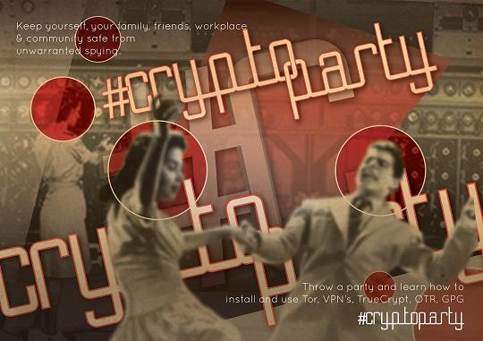

% Cryptoparty - Eine Einführung
% {{Speaker Name}}
% {{Month}} {{Date}}, {{Year}}

# 

- Privatsphäre ist für eine offene Gesellschaft im elektronischen Zeitalter notwendig. Es ist keine Geheimniskrämerei. Eine Privatangelegenheit ist etwas, von dem man möchte, dass es nicht die ganze Welt weiß. Hingegen ist eine geheime Angelegenheit ist etwas von dem möchte dass es niemand weiß.
- Privatsphäre ist die Macht selektiv zu entscheiden was, man von sich preis gibt. ~Cypherpunk Manifest (freie Übersetzung)

# Was ist 'Crypto'?

Kryptologie ist:

- Ein Haufen komplizierte Mathematik
- Die Basis für viele Sicherheitsmechanismen
- Eine Kernfunktionalität des Internets

Kryptologie ist nicht:

- Die Lösung für alle Sicherheitsprobleme
- Sicher wenn es nicht richtig implementiert und benutzt wird
- Etwas was man versuchen sollte selber zu erfinden

# Was ist eine Party?
- Eine Gelegenheit Spaß zu haben.
- Nette Leute und Freunde (Hinweis: Bringt eure Freunde mit).
- Musik.
- Getränke & Knabberkram.

# Crypto + Party = Cryptoparty

# Warum brauchen wir Kryptologie?
- Um grundlegenden Sicherheitsbedürfnissen nach zu kommen
- Schutz von Vertraulichkeit und Privatsphäre
- Anonymität
- Authentizität
- Integrität

# Privatsphäre
- Die Kontrolle über die persöhnlichen Informationen und Handlungen zu haben
- Technisches Eindringen in Privatsphäre
- Cookies, Überwachungskameras, Metadaten, Soziale Netzwerke, Suchmaschienen, Telekommunikationsanbieter, etc.
- Moralisches Eindringen in die Privatsphäre
- "Wenn du nichts falsches/verwerfliches getan hast, was hast dann zu verbergen?"
- Kryptologie ist Teil der Antwort
- Sichere Kommunikation
- Festplattenverschlüsselung

# Sicherheit im Gegensatz zu Privatsphäre

# Anonymität

- Unerkannt handeln können
- Vollständige Anonymität (ist schwierig)
- Der wahre Autor ist nicht verfolgbar
- Pseudonymität (ist nicht so schwierig)
- Es ist möglich einen Autor mit einem Pseudonym zu verknüpfen
- Kryptologie liefert einen Teil der Antwort
- TOR
- Bitcoins

# Authentifizierung
- Kontinuität einer Beziehung, wissen wem man vertrauen kann und wem nicht.
- Wo ist die Authentifizierung über ein digitales Netzwerk?
- Kryptologie liefert einen Teil der Antwort
- Kryptologie mit öffentlichen Schlüssel
- SSH, TLS
- Dynamisches Vertrauen schenken und zurückziehen
- Skaliert nicht gut

# Integrität
- Integrität hat mit der Echtheit von Daten zu tun
- Veröffentlichen vom Schreibtisch aus ist günstig und einfach
- Es ist einfach Daten zu modifizieren oder zu fälschen
- Wie verifizieren wir die Integrität von dem, was wir online sehen?
- Kryptologie kann eine Antwort liefern
- Hash Funktionen

# Warum eine Cryptoparty?
- Es ist dringend nötig Bewustsein zu schaffen für:
- Kryptologie
- Sicherheitswerkzeuge
- Schutz der Privatsphäre
- Workshops zum mitmachen
- Emails, Internet Verkehr, Chat, Festplattenverschlüsselung, Anonymitätswerkzeuge, NENN es MACH es.
- Bewusstsein für die rechtliche Seite
- Evolution von Privatsphären Gesetzen in verschiedenen Ländern
- Kurzvortäge
- Teilt euer Wissen

# Was kommt als nächstes?

