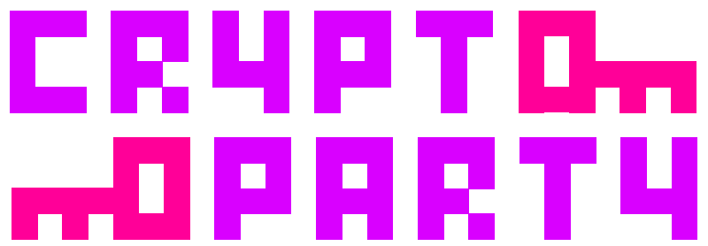

% Cryptoparty - Risikomanagement
% {{Name des Vortragenden}}
% {{Monat}} {{Datum}}, {{Jahr}}

# Cryptoparty

# Sicherheit bedeutet Trade-Offs einzugehen um Risiken zu begegnen

- Sicherheit bedeutet nicht, das stärkste Schloss oder das beste Antivirus-Programm zu haben - Sicherheit bedeutet Trade-Offs einzugehen um Risiken zu begegnen, etwas das wir in vielen Ausprägungen täglich tun.
- Wenn du abwägst, die Straße irgendwo zu überqueren anstatt bei einem Zebrastreifen, dann machst du einen Sicherheits-Trade-Off: Du erwägst die *Bedrohung* überfahren zu werden gegenüber bis zum Zebrastreifen weiterzugehen und du begegnest dem *Risiko* dieser *Bedrohung* indem du nach vorbeifahrenden Autos Ausschau hälst.
- Deine körperliche Unversehrtheit ist das *Gut* das du beschützen möchtest.
- Wie hoch ist das *Risiko* überfahren zu werden und bist du so in Eile, dass du dies zulassen möchtest, selbst wenn die *Bedrohung* auf dein höchstes *Gut* abzielt?
- Dies ist eine Sicherheits-Entscheidung. Nicht allzu schwierig, oder? Das einzige, an das man sich gewöhnen muss, ist die spezielle Sprache.
- Sicherheitsexperten benutzen vier unterschiedliche aber miteinander verbundene Konzepte, wenn sie über Sicherheits-Entscheidungen sprechen: *Güter*, *Bedrohungen*, *Risiken* und *Gegenspieler*.

# Güter

- Das, was du beschützt
- Ein Gut ist etwas Wertvolles, das du beschützen möchtest.
- Alles Wertvolle kann ein Gut sein, aber im Kontext dieses Vortrages sind die besprochenen Güter meist Informationen.
- Beispiele sind deine Mails oder die deines Unternehmens, Chatnachrichten, Dateien und Webseiten, genau wie Computer, die alle diese Informationen bereit halten.

# Bedrohungen

- Vor was du dich schützt
- Eine Bedrohung ist etwas Schlechtes, das einem Gut zustoßen kann.
- Sicherheitsexperten teilen die Auswirkungen von Bedrohungen auf deine Daten-Güter in sechs Teilbereiche auf, die gegeneinander abgewogen werden müssen: 

- 1. Vertraulichkeit - handelt davon, Güter oder Wissen über diese Güter von unautorisierten Parteien fernzuhalten.
- 2. Integrität - handelt davon, deine Güter unbeschadet und unmodifiziert aufzubewahren.
- 3. Verfügbarkeit - ist die Zusicherung, dass deine Güter nur den Parteien zugänglich sind, die für ihre Nutzung autorisiert sind.
- 4. Konsistenz - wenn Güter sich so verhalten und funktionieren wie erwartet, und zwar jederzeit.
- 5. Kontrolle - ist die Regulation des Zugriffs auf Güter.
- 6. Audit - ist die Fähigkeit sicherzustellen, dass deine Güter sicher sind.

# Klassifikation von Bedrohungen

- Bedrohungen können anhand der Arten von Sicherheit, die sie bedrohen, eingeteilt werden.
- Beispielsweise könnte eine Person, die versucht deine Mails (das Gut) ohne deine Zustimmung zu lesen ihre *Vertraulichkeit* und deine *Kontrolle* über die Mails bedrohen.
- Wenn der Gegenspieler deine Mails zerstören oder dich am Zugriff darauf hindern will, zielt der Angreifer auf die *Integrität* und die *Verfügbarkeit* deiner Mails.
- Indem du Verschlüsselung benutzt, die wir später erklären werden, kannst du dich gegen einige dieser Bedrohungen schützen.
- Verschlüsselung beschützt nicht nur die *Vertraulichkeit* der Mails, indem sie sie in eine Form verwürfelt, die nur du und dein Gesprächspartner wiederherstellen können. Sie dient auch dazu, die Mails zu *auditieren* - das bedeutet, zu überprüfen und nachzusehen, dass derjenige, der behauptet Sender zu sein wirklich diese Person ist oder zu bestätigen, dass die Mail zwischen dem Absender und dir nicht verändert wurde und um sicherzustellen, dass die *Integrität* der Mail und deine *Kontrolle* darüber beibehalten wurden. 

# Risiken - Die Wahrscheinlichkeit, dass Bedrohungen wirklich auftreten

- Risiko ist die Wahrscheinlichkeit, dass eine bestimmte Bedrohung gegen ein bestimmtes Gut wirklich auftritt und wie sehr beschädigt dieses Gut dabei würde.
- Es gibt einen wichtigen Unterschied zwischen Bedrohungen und Risiken: Bedrohungen sind schlimme Dinge, die deinen Gütern widerfahren können. Risiken hingegen sind Wahrscheinlichkeiten, dass gewisse Bedrohungen wahr werden.
- Welche Güter versuchst du zu beschützen?
- Was sind die Risiken dieser Güter?
- Wie gut mildert die Sicherheits-Lösung diese Risiken?
- Welche anderen Risiken bringt die Sicherheits-Lösung mit sich?
- Welche Kosten und Trade-Offs kommen durch die Sicherheits-Lösung auf dich zu?
- Sicherheit ist die Kunst, den Wert des Gutes, das du beschützen möchtest gegenüber den Kosten, einen Schutz gegen bestimmte Risiken einzurichten, auszubalancieren.
- Praktische Sicherheit fordert von dir, das tatsächliche Risiko einer Bedrohung einzuschätzen, um zu entscheiden welche Sicherheitsvorkehrungen für den Schutz deiner Güter nutzenswert wären, und welche davon absolut notwändig sind.

# Gegenspieler

- Wer stellt eine Bedrohung dar?
- Der kritische Punkt in der Begegnung des Risikos und der Auswahl zugehöriger Sicherheits-Lösungen ist es zu wissen, wer oder was dein Gegenspieler ist.
- In Sicherheits-Fachsprache ist ein Gegenspieler eine Person oder Entität, die eine Bedrohung gegen ein Gut darstellt.
- Verschiedene Gegenspieler stellen verschiedene Bedrohungen gegen verschiedene Güter dar; verschiedene Gegenspieler fordern verschiedene Lösungen.
- Wenn du beispielsweise dein Haus vor irgendeinem Einbrecher schützen möchtest, muss dein Türschloss lediglich besser sein als das deines Nachbarn, oder dein Vorgarten besser beleuchtet sein, sodass der Einbrecher das andere Haus wählen würde.
- Wenn dein Gegenspieler die Regierung ist, würde die Investition in ein besseres Türschloss verschwendet sein - wenn die Regierung dich verfolgt und dein Haus durchsuchen will, wird es nichts nützen wie gut deine Sicherheit im Vergleich zu der deines Nachbarn ist.
- Du wärst dann besser daran geraten, Zeit und Geld in andere Sicherheitsmechanismen zu stecken, wie die Verschlüsselung deiner wertvollen Informationen, damit die Regierung sie nicht lesen kann wenn sie sie beschlagnahmt.

# Beispiele für Gegenspieler, die eine Bedrohung für digitale Privatsphäre und Sicherheit darstellen

Hier sind einige Beispiele für die Typen von Gegenspielern, die eine Bedrohung für deine digitale Privatsphäre und Sicherheit darstellen könnten:

- Agenten der US-Regierung, die Gesetze befolgen, welche ihre Aktivitäten einschränken
- Agenten der US-Regierung, die willens und fähig sind, ohne gesetzliche Beschränkungen zu arbeiten
- Andere Regierungen
- Zivilkläger, die dich für etwas anklagen oder anklagen wollen
- Firmen, die deine Daten für dich speichern oder anderweitig Zugriff darauf haben
- Einzelne Mitarbeiter von diesen Firmen
- Hacker oder Bandenmitglieder, die willkürlich in deinen Rechner einbrechen oder in die Rechner der Firmen, die deine Daten aufbewahren
- Hacker oder Bandenmitglieder, die gezielt deinen Rechner angreifen oder die Rechner der Firmen, die deine Daten aufbewahren
- Stalker, Privatdetektive oder Privatpersonen, die deine Kommunikation belauschen oder Zugriff auf deine Rechner erlangen wollen

# Welche Bedrohungen von welchen Gegenspielern stellen das höchste Risiko gegen deine Güter dar?

- Zusammenfassend solltest du herausfinden, welche Bedrohungen deiner Güter von welchen Gegenspielern das größte Risiko darstellen und anschließend entscheiden, wie du diesen Bedrohungen begegnest.
- Kluges Abwägen von Risiken und Kosten ist die Essenz von Sicherheit.
- Wie viel ist die Abmilderung eines Risikos wert?
- Du könntest zum Beispiel feststellen, dass Gegenspieler aus der Regierung eine Bedrohung für deinen Webmail-Account darstellen, da sie dessen Inhalte im Geheimen anzapfen können.
- Wenn du das Risiko dieses Gegenspielers als hoch einschätzt, könntest du dich dafür entscheiden, deine Mails auf deinem eigenen Rechner zu speichern anstatt auf dem Rechner der Webmail-Firma.
- Wenn du das Risiko als gering einschätzt, könntest du dich dafür entscheiden, die Mails weiterhin bei der Webmail-Firma zu lagern - du tauschst Sicherheit gegen einen bequemen Zugriff auf deine Mails von jedem mit dem Internet verbundenen Computer.
- Wenn du das Risiko nur als mittelgroß einschätzt, könntest du die Mails bei der Webmail-Firma lassen, aber die Unbequemlichkeit von Verschlüsselung auf dich nehmen, um die Vertraulichkeit deiner wichtigsten Mails zu schützen.
- Letztendlich liegt es bei dir zu entscheiden, welche Trade-Offs du gewillt bist einzugehen um deine Güter zu beschützen.

# Links
- https://ssd.eff.org/risk
- https://www.schneier.com/book-beyondfear.html

# Fragen

